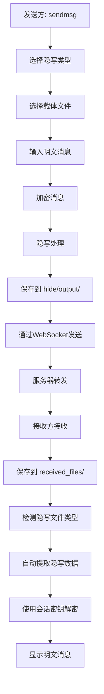

# 📁 文件传输和隐写提取流程图

## 🔄 完整流程



## 📋 详细步骤

### 🚀 发送方操作

1. **用户输入命令**
   ```bash
   > sendmsg
   ```

2. **选择隐写类型**
   ```
   请选择隐写类型（image/pdf/video）: image
   ```

3. **选择载体文件**
   ```
   📁 可用的image文件: test_image.png
   请输入载体文件名: test_image.png
   ```

4. **输入消息**
   ```
   请输入要发送的明文消息: Hello, secret message!
   ```

5. **系统处理**
   - 加密消息 → 生成密文
   - 隐写处理 → 将密文嵌入图片
   - 保存到 `hide/output/stego_image_xxx.png`
   - 通过WebSocket发送文件

### 📥 接收方自动处理

1. **接收文件消息**
   ```
   [系统] 收到来自 alice 的文件: stego_image_xxx.png (类型: image)
   ```

2. **自动保存文件**
   ```
   [系统] 文件已保存: /path/to/received_files/stego_image_xxx.png
   ```

3. **检测隐写文件**
   ```
   [系统] 检测到隐写文件，开始提取...
   ```

4. **自动提取和解密**
   ```
   [系统] 隐写提取成功，数据大小: 45 bytes
   [alice] (隐写消息) Hello, secret message!
   ```

## 📁 文件路径说明

### 发送方路径
- **载体文件**: `test/test_image.png`
- **隐写输出**: `hide/output/stego_image_xxx.png`
- **发送**: 通过WebSocket传输

### 接收方路径
- **接收文件**: `received_files/stego_image_xxx.png`
- **自动处理**: 提取 → 解密 → 显示

## 🔐 安全特性

1. **端到端加密**: 消息使用会话密钥加密
2. **隐写隐藏**: 密文隐藏在载体文件中
3. **自动处理**: 接收方无需手动操作
4. **密钥管理**: 自动生成和交换会话密钥

## 💡 使用优势

1. **自动化**: 接收方无需手动提取隐写消息
2. **安全性**: 双重保护（加密+隐写）
3. **便利性**: 文件自动保存到指定目录
4. **实时性**: 消息即时传输和处理

## 🎯 实际使用示例

### 发送方日志
```
=== 发送隐写消息 ===
请选择隐写类型（image/pdf/video）: image
📁 可用的image文件: test_image.png
请输入载体文件名（或完整路径）: test_image.png
请输入输出文件名（留空使用默认名称）: 
📁 输出路径: /Users/umiri/Projects/e2e_tool/hide/output/stego_image_1753762642.png
请输入要发送的明文消息: Hello, this is a secret message!
[系统] 开始发送隐写消息...
[系统] 加密消息...
[系统] 执行隐写处理...
[系统] 发送隐写文件...
[系统] 隐写消息已发送: /Users/umiri/Projects/e2e_tool/hide/output/stego_image_1753762642.png
```

### 接收方日志
```
[系统] 收到来自 alice 的文件: stego_image_1753762642.png (类型: image)
[系统] 文件数据大小: 12345 bytes
[系统] 文件已保存: /Users/umiri/Projects/e2e_tool/received_files/stego_image_1753762642.png
[系统] 检测到隐写文件，开始提取...
[系统] 隐写提取成功，数据大小: 45 bytes
[alice] (隐写消息) Hello, this is a secret message!
```

## ✅ 总结

你的理解完全正确！整个流程是：

1. **发送方** → 隐写处理 → 保存到 `hide/output/` → 发送
2. **接收方** → 接收文件 → 保存到 `received_files/` → 自动提取解密 → 显示消息

这是一个完全自动化的端到端加密隐写通信系统！ 